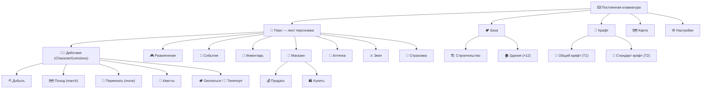
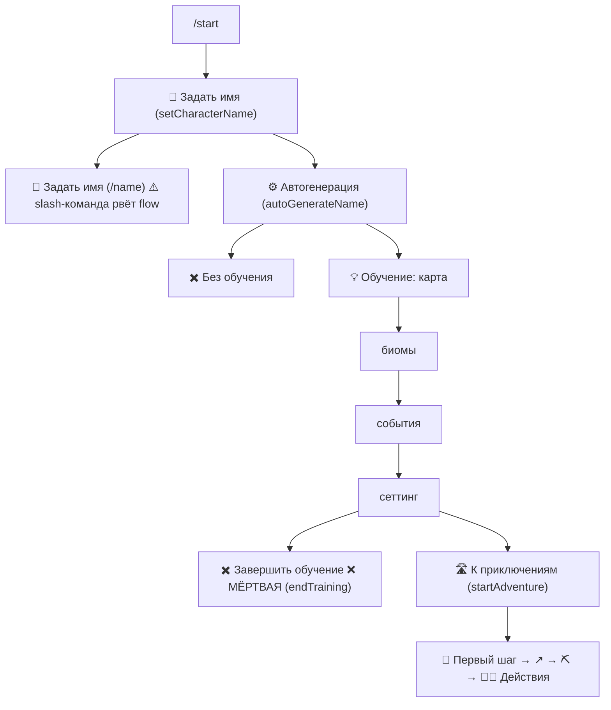
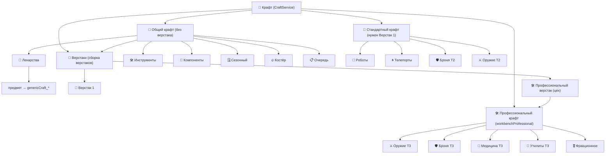
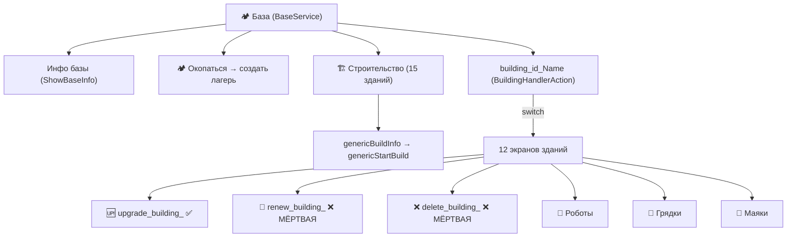

# 🧭 Карта навигации игры «Wild World»

> Сгенерировано 2026-05-22. Источник графа — детерминированный экстрактор
> `App\Services\Navigation\NavigationMapService` (читает код, не дрейфит).
> Живая интерактивная версия: **админка → `/admin/navigation`** («Дерево навигации»).
> Сырые данные: [`navmap.json`](./navmap.json) (узлы/рёбра/точки входа/метрики).

Этот документ — north-star для глобального UI/UX-рефакторинга навигации. Сначала
**схемы и блоки** (что есть сейчас), затем **консолидированный backlog** проблем,
затем **план рефактора** по сессиям (каждое изменение — через фреймворк валидации).

> ✅ **N1 «Мёртвые кнопки» ВЫПОЛНЕН (2026-05-22).** Мёртвые кнопки **72 → 19**
> (остаток — рантайм-динамические callback'и, не баг). Убраны: `renew_building_`/
> `delete_building_` во всех 12 зданиях (24 шт; решение — убрать, т.к. истечение
> построек не enforced); 4 нерабочие кнопки роботов; зомби-меню `GeneralCrafting`;
> `noAction` в Gear**Weapon**/**Armor**Detail (вне базы — причина в caption, без мёртвой кнопки).
> Перенаправлены на рабочие маршруты: `endTraining` → `withoutTrainingStart`;
> «Лечиться» (событие низкого HP) `craftBandage` → `pharmacy`. Экстрактор улучшен —
> пропускает закомментированный код (метрика теперь про реально кликабельные кнопки).
> Метрики ниже отражают пост-N1 состояние. **N1–N6 в проде (N6 = E24, ADR-123). Навигационный бэклог N-серии закрыт.**

> ✅ **N4 «Онбординг» ВЫПОЛНЕН (2026-05-22).** (1) `/name` slash → **ForceReply** в онбординге:
> «📝 Задать имя» шлёт forceReply-промпт (маркер «✍ NAME»), `GenericmessageCommand` ловит ответ →
> новый `App\Services\Player\NameService` (валидация+tier-логика, общий с `/name`-слэшем, который
> оставлен для переименований). (2) **Прогресс-индикатор** «📍 Шаг N/4» на 4 экранах обучения.
> (3) **Двойное сообщение на /start** убрано: reply-клавиатуру шлём только новичку (существующим её
> ставит CharacterService). (4) **Вход к выбору фракции** on-demand: условная кнопка «⚑ Выбрать фракцию»
> на листе персонажа (lvl≥10 без фракции → `chooseFaction_info`); раньше только крон-пинг раз в 24ч.

> ✅ **N3 «Честные тексты» ВЫПОЛНЕН (2026-05-22).** caption=реальность: Weapons/ArmorCraft2Select
> «10 образцов»→честные 4. MEDIA-OFF: `GetTrainingStartAction` «На изображении выше» → image-independent.
> `$`→`💰`: `SellCraftItemAction` + `BuyCraftItemListAction`. reply-клавиатура: `CharacterService`
> вернула строку «Настройки» (терялась при «Перс»). Единое имя «🗺️ Поход»: «Изучить местность»(🗺️) +
> «Дальний поход»(🚜) → «🗺️ Поход» в 6 кнопках (callback `march` без изменений) + 3 подсказки; 🚜
> освобождён для `move`=Переехать. namespace `app\`→`App\` (PSR-4): GearAction, TeleportationCenterHandler,
> CampCancelAction (+фикс lowercase-ссылки в NavigationMapService) → baseline перегенерён (case-ошибки
> ушли, legacy re-key). Мини-игры: честный текст (Угадай-число «вдвое меньше»→«×1.2 от ставки (+20%)»;
> КНБ — фикс устаревшего код-комментария 20%→40%). **Баланс мини-игр (шансы/кап/выплаты) → N5** (user-pick).

> ✅ **N2 «Назад везде» ВЫПОЛНЕН (2026-05-22).** Добавлена кнопка «⬅️ Назад» в **34 крафт-превью**
> (Medical 8 / Components 10 / Tools 8 → к экрану-категории `medicinesCraft1`/`componentsCraft`/`tools`;
> Weapons 4 / Armor 4 → `weaponsCraft2`/`armorCraft2`) — во ВСЕ ветки клавиатуры (insufficient + can-craft).
> Закрыты тупики §6: `GearAction` (→ персонаж), `CalculateInsuranceAction` (→ страховка/персонаж),
> `TeleportBeacon` при 0 шт. (→ «🔧 Скрафтить маяк» + «🏠 База»), `SellCraftAction`/`BuyCraftAction`
> экраны-ошибки (→ магазин/персонаж), результат ForceReply-сделки (`GenericmessageCommand` → магазин/инвентарь),
> `TeleportationCenterHandler` (+ кнопка «📡 Маяки» — функция здания теперь доступна с его экрана).
> ⚠️ **Drift-правка:** в §6 значилось «22 превью», по факту их **34** (не были учтены 8 Tools +
> ветки can-craft). `ToggleInsuranceAction` уже имел возврат (делегирует PersonalInsurance) — не трогали.

---

## 1. Как устроена навигация (модель)

Игрок взаимодействует через **inline-кнопки** Telegram. У каждой кнопки есть
`callback_data`. Диспетчер `CallbackqueryCommand::execute()` разбирает его так
(5 слоёв, по порядку):

1. `$action = explode('_', callback_data)[0]` — первый сегмент.
2. **`character`** shortcut → `CharacterService::showCharacterInfo` (лист персонажа).
3. **Wildcard** (`Config\CallbackRoutes::$wildcardRoutes`): `move_dir_*`, `march_*`, `eventPref_*`.
4. **Prefix-dispatcher** (`CallbackPrefixDispatcher`): `pollVote_`, `upgrade_building_`,
   `confirm_upgrade_building_`, `StartRelocationConfirm_`, `confirm_repair_`, `repair_`.
5. **Exact / prefix** (`Config\CallbackRoutes::resolve()`): точное совпадение по первому
   сегменту, затем `prefixRoutes` (`sellResource`, `cancelQueued`, `craftPreview*`).

Каждый action-handler рендерит **следующий экран** (caption + новая клавиатура).
Точки входа — постоянная reply-клавиатура и слэш-команды.

> ⚠️ **Конституция MEDIA-OFF:** игрок может отключить картинки; caption обязан быть
> самодостаточным. Любая правка навигации/текстов должна работать без изображений.

---

## 2. Метрики графа

| Метрика | Значение | Что значит |
|---|---:|---|
| Экранов (узлов) | **223** | классы, рендерящие экран / эмитящие кнопки |
| Переходов (рёбер-кнопок) | **857** | резолвленные кнопки экран→экран (+43 после N2 «Назад») |
| Точек входа | **9** | reply-клавиатура (5) + слэш-команды (4) |
| **Мёртвые кнопки** | **19** | было 72 до N1; остаток — рантайм-динамика, не баг |
| Тупики (экран без кнопок) | **23** | нет навигации дальше (часть легитимна; −1 после N2) |
| Сироты (недостижимы) | **49** | ни одна кнопка/маршрут не ведёт сюда |
| Макс. глубина | **7** | кликов от точки входа до самого глубокого экрана |

> После N1 оставшиеся 19 «мёртвых» — это **динамические** callback (`'questStart'.$title`,
> `$callbackData`, `$captureData`, `$nextStep` и т.п.), которые резолвятся в рантайме;
> статически их не проверить. Реально кликабельных мёртвых кнопок не осталось.
> Сироты в группе `task-results` (24) — это async-хендлеры завершения задач: достижимы
> не кнопкой, а по таймеру/событию — это норма, не баг.
>
> **E28 Ф2 пере-скан (2026-06-14, `php spark navmap:export`):** граф вырос до **300 nodes /
> 1167 edges** (накопленный E-блок), `unresolved` = **44** (было 21). Спот-чек подтвердил —
> это по-прежнему **статически-нерезолвимые динамические callback'и**, а НЕ настоящие мёртвые
> кнопки: онбординг `getTrainedStart2..7` (через `$nextStep`, все routed), `npcAct_talk_<id>`
> (💬 Поговорить), `teleportBeaconSet_capture_` (👀 Перехватить), интерполяции
> `{$gold}`/`{$goldPrice}`/маяк-координаты — все резолвятся в рантайме (exact/prefix-роуты).
> Сканер также ложно ловит имена переменных (`callback_data`, `name`, `label`, `$buttonText`).
> **Вывод: «0 unresolved» недостижима статическим сканом** (динамические callback'и — норма
> кодовой базы); метрика годна как trend-watch, не абсолют. Реально кликабельных мёртвых кнопок
> не найдено (🔴-реестр §7.1 #1-3 закрыт). Апгрейд сканера до data-flow (резолв `$var='literal'`)
> — отдельная задача NavigationMapService, вне E28.

---

## 3. Точки входа

| Триггер | Тип | Ведёт на экран |
|---|---|---|
| `/start` | команда | онбординг (новый) / лист персонажа (существующий) |
| `/tasks` | команда | активные задачи (таймеры) |
| `/tips` | команда | советы |
| `/settings` | команда | настройки |
| **Перс** | reply-кнопка | `CharacterService` — лист персонажа |
| **База** | reply-кнопка | `BaseService` — меню базы |
| **Крафт** | reply-кнопка | `CraftService` — меню крафта |
| **Карта** | reply-кнопка | `MapService` — карта мира |
| **Настройки** | reply-кнопка | `SettingsAction` |

---

## 4. Схемы навигации

### 4.1 Верхний уровень

### 4.2 Онбординг (новый игрок)

### 4.3 Крафт (тиры) — самый глубокий домен

> **2 верстака / 3 уровня крафта** (ADR-130, 2026-06-16). Верстаков ровно два: 🔬 Верстак 1 (→ Стандартный крафт) и 🛠 Профессиональный верстак / «цех» (→ Профессиональный крафт). Все три уровня крафта теперь имеют прямую кнопку в меню крафта (раньше «Профессиональный» был доступен только через Общий → Верстаки → сборка). Ярлык «Верстак 3 (T3)» убран — создавал ложное ощущение пропущенного «второго» верстака.

### 4.4 База

---

## 5. 🔴 Реестр мёртвых кнопок (критично)

Кнопка существует в UI, но `callback_data` не резолвится → клик в никуда
(часто без `answerCallbackQuery` → у игрока «часики» висят и тишина).

| Кнопка | callback | Где (file:line) | Масштаб |
|---|---|---|---|
| 🔄 Обновить постройку | `renew_building_<id>` | все 12 `*Handler.php` | 12 экранов |
| ❌ Удалить строение | `delete_building_<id>` | все 12 `*Handler.php` | 12 экранов |
| ✖️ Завершить обучение | `endTraining` | `GetTrainingStart4Action.php:75` | финал онбординга |
| (экип не на базе) | `noAction` | `GearWeaponDetailAction.php:169` | экип |
| 🤖 4 робота | `robotWatcher/Assistant/Turret/Builder` | `RobotsCraft2Select.php` | T2 роботы |
| зомби-меню | `weapons/food/clothes/transport/miscellaneous` | `GeneralCraftingAction.php:19-38` | перезаписанный массив |
| ✅ ~~Профи/Уникальный крафт~~ | `workbenchProfessional` | `CraftService.php` — РЕШЕНО (ADR-130): «Профессиональный крафт» теперь прямая кнопка; фантомные «Профи/Уникальный» направления свёрнуты в реальную модель «2 верстака / 3 уровня» | меню крафта |
| оружие/броня T2 поз. 5-10 | закомментированы | `WeaponsCraft2Select.php`, `ArmorCraft2Select.php` | caption лжёт (10 vs 4) |
| — | — | `SellSelectRarity1Action.php` (dead code, сирота) | — |

---

## 6. 🟢 Тупики без «Назад» (добавить навигацию)

| Экран | Файл | Проблема |
|---|---|---|
| 22 крафт-превью T1/T2 | `WorkbenchGeneral/Medical,Components/*`, `WorkbenchStandard/Weapons,Armor/*` | нет «⬅️ Назад» (в T3 есть — тиражировать) |
| Экип (раздел) | `Profile/GearAction.php` | нет возврата к листу персонажа |
| Расчёт страховки | `CalculateInsuranceAction.php:69` | `out=0`, нет кнопок |
| Тумблер страховки | `ToggleInsuranceAction` | `out=0` |
| После ввода кол-ва (ForceReply) | `GenericmessageCommand.php:177` | результат сделки без кнопок навигации |
| Sell/BuyCraft ошибки | `SellCraftAction.php`, `BuyCraftAction.php` | каждый `return` без `reply_markup` |
| Маяки при 0 шт | `TeleportBeacon.php` | нет кнопки «скрафтить маяк» |
| Центр телепортации | `TeleportationCenterHandler.php` | нет кнопки «Маяки» (функция здания недоступна с его экрана) |

---

## 7. 📋 Консолидированный UX-backlog

Классификация по фреймворку валидации: 🔴 строго / 🟠 с ADR / 🟡 подумать / 🟢 всегда.

### 7.1 🔴 / баги (наивысший приоритет)

> ✅ **E28-аудит 2026-06-14:** пункты 1–3 проверены в текущем коде и устранены ранее
> (нигде не emit'ятся и не routed): `renew_building_`/`delete_building_`, `endTraining`,
> `noAction`. Помечены ✅. Доказательство: grep по callback_data + `Config\CallbackRoutes`.

1. ✅ **24 мёртвые кнопки `renew_building_`/`delete_building_`** — устранены (не emit'ятся, не routed).
2. ✅ **`endTraining` → `withoutTrainingStart`** — устранено (emit'ится только `withoutTrainingStart`).
3. ✅ **`noAction` в GearWeaponDetail** — устранено (не emit'ится, не routed).
4. **`RobotsCraft2Select`: 4 нерабочие кнопки** — не показывать до реализации.
5. ✅ **(N5)** `sleep(2)` в FortuneWheelAction убран — больше не блокирует PHP-воркер.
6. ✅ **(N5)** `RockPaperScissors` 40%-cap снят (честные 33/33/33) + GuessNumber честный 1-из-N + Колесо честные шансы/количества — обман устранён, баланс в GameSettings.

### 7.2 🟢 (безопасные, высокий ROI)

7. **Добавить «⬅️ Назад» в 22 крафт-превью + Gear + Insurance + Sell/BuyCraft-ошибки** (см. §6).
8. **Кнопки навигации после ForceReply-сделки** (`GenericmessageCommand::handleTradeReply`).
9. **Единое имя действия «Поход»**: сейчас «Изучить местность» / «Дальний поход» / «Поход» — 3 метки одного экрана. Развести иконки `move`=🚶 vs `march`=🗺️ (оба сейчас 🚜).
10. **reply-клавиатура теряет «Настройки»** при «Перс» (`CharacterService.php:60-64` — добавить строку).
11. **MEDIA-OFF фиксы текстов**: «На изображении выше карта» (`GetTrainingStartAction.php:63`), «в переписке остаётся кнопка» (`WithoutTrainingStartAction.php:49`).
12. **Валюта `$`→`💰`** в `SellCraftItemAction.php:68-69`.
13. **Синхронизировать caption с кнопками**: `CraftService` (текст про 4 тира, кнопки 2), `WeaponsCraft2Select`/`ArmorCraft2Select` (10 vs 4), удалить зомби-меню `GeneralCraftingAction:19-38`.

### 7.3 🟡 (обдумать)

14. **`/name` → ForceReply** в онбординге (slash-команда рвёт inline-flow; паттерн SELL:/BUY: уже есть).
15. **Точка входа к выбору фракции** для lvl≥10 без фракции (сейчас только cron-пинг раз в 24ч).
16. **Прямой вход «Магазин»** из главного меню (сейчас только из ошибок/предметных экранов).
17. **Quest-dispatcher устойчивость**: `questStart<title>` динамический, но в `CallbackRoutes` 4 хардкод-ключа → новый квест = мёртвая кнопка. Ввести `questStart`-prefix dispatcher.
18. **Кнопка «Продать всё»** (логика `'all'` уже есть в `finalizeSale`, кнопки нет).
19. **Группировка 15 зданий** в `BuildListAction` по назначению (когнитивная нагрузка новичка).
20. **`array_chunk` кнопок роботов** (`AllRobotsHandler` — всё в один ряд).
21. **edit-in-place** для `CharacterService` и 12 зданий (сейчас новое сообщение → флуд чата).
22. **Превью/гейтинг для готовки** (`CampfireCookingSelect` стартует без экрана наличия).

### 7.4 🟠 (через ADR / GameSettings)

23. ✅ **(N5, ADR-040)** Хардкод-пороги золота + весь баланс мини-игр → GameSettings (категория `economy`, 20 ключей): `BuyCraftAction` (1000), `BuyResourceAction` (10), шансы/выплаты/количества Угадай+Колесо+КНБ.
24. ✅ **(N6/E24, ADR-123)** PvP-поток dead-end'ы закрыты: защитник теперь получает клавиатуру (`postBattleKeyboard`) — не тупик; «▶️ Продолжить поход» (`march_resume`) после боя при приостановленном походе для обеих сторон. Audit вскрыл premise стейл (уведомление защитнику + battle-log v2 + pause/resume УЖЕ были). Gap «уведомление об обнаружении» сознательно не взят (мгновенный бой → шум). Чистая presentation, RNG-fence не тронут.
25. ✅ **(E28, v0.51.442)** Динамический `buildingId`: 10 хендлеров зданий + 2 активатора роботов резолвят id по стабильному `name_en` через `BuildingModel::idByNameEn()` (хардкод-ID убран; Arsenal уже был динамическим). Корень — позиционные ID дрейфят при реседе/реордере миграций (ArsenalHandler когда-то держал «15», реально id=11; 15 = «Дозорная вышка»). Анти-дрифт гейт `tests/unit/BuildingHandlerNoHardcodedIdTest` + DB-тест `BuildingModelFindByNameEnTest`.

### 7.5 Технический долг (выявлено попутно)

26. **Namespace в нижнем регистре**: `GearAction.php:3` и `TeleportationCenterHandler.php` объявлены `namespace app\…` вместо `App\` (PSR-4 рассинхрон; работает из-за CI PHP, но ломает анализаторы и граф). 🟢 безопасный фикс.

---

## 8. Топ-проблема каждого домена (severity × усилие)

| Домен | №1 проблема | Класс |
|---|---|---|
| Онбординг/персонаж | `endTraining` мёртв; `/name` рвёт flow; reply теряет «Настройки» | 🔴/🟡/🟢 |
| Крафт | 22 превью без «Назад»; зомби-меню; caption≠кнопки | 🟢/🟡 |
| База | 24 мёртвые `renew/delete`; функция здания недоступна с его экрана | 🔴/🟠 |
| Мир/бой/квесты | `move` vs `march` путаница; нет входа к фракции; PvP-защитник без кнопок | 🟢/🟡/🟠 |
| Экономика/игры | ForceReply-тупик; insurance dead-ends; `sleep(2)`; врущие тексты игр | 🟢/🔴 |

---

## 9. План рефактора (предложение, по сессиям)

Каждое изменение проходит фреймворк валидации (7 ворот). Группировка по риску:

- **N1 — «Мёртвые кнопки» (🔴, 1 сессия):** убрать/реализовать `renew/delete_building`,
  `endTraining`, `noAction`, нерабочие роботы, зомби-меню. Чистый выигрыш доверия.
- **N2 — «Назад везде» (🟢, ✅ выполнен 2026-05-22):** добавлена навигация в 34 превью (не 22 — drift)
  + тупики §6. Тиражирование готового T3-паттерна, нулевой риск регрессии.
- **N3 — «Честные тексты» (🟢, ✅ выполнен 2026-05-22):** caption=кнопки, MEDIA-OFF фиксы, `$`→`💰`,
  честный текст мини-игр (баланс → N5), единое имя «🗺️ Поход», namespace-фиксы PSR-4.
- **N4 — «Онбординг» (🟡, ✅ выполнен 2026-05-22):** `/name`→ForceReply (NameService),
  прогресс-индикатор «Шаг N/4», убран двойной /start-месседж, on-demand вход к фракции.
- **N5 — «Баланс в админку» (🟠, ADR-040, ✅ выполнен 2026-05-22):** золото-пороги магазина +
  весь баланс 3 мини-игр → GameSettings (категория `economy`, 20 ключей). Параллельно убран
  системный обман: Угадай — честный 1-из-N (был фейк), КНБ — честные 33/33/33 (снят 40%-cap),
  Колесо — раскрыты шансы + узаконено ×6/×10 (врало x5/x8) + удалён `sleep(2)`; навык-слив убран.
- **N6 — «PvP-поток» (✅ ЗАКРЫТ, E24, ADR-123):** клавиатура защитнику (был тупик) + resume-поход после боя (`march_resume`) для обеих сторон. Audit: premise стейл (уведомление/battle-log/pause-resume уже были). RNG-fence не тронут. «Уведомление об обнаружении» не взято (мгновенный бой → шум).

---

## 10. Инструменты (как поддерживать карту актуальной)

| Что | Где |
|---|---|
| Живая интерактивная карта | `/admin/navigation` («Дерево навигации» в sidebar) |
| Сервис-экстрактор | `App\Services\Navigation\NavigationMapService` |
| JSON-эндпоинт (live) | `GET /admin/navigation/data` |
| Регенерация снимка в репо | `php spark navmap:export` → `docs/navigation/navmap.json` |
| Архитектурное решение | `mmorpg-vault/decisions/ADR-039-Navigation-map-tooling-and-UX-audit.md` |

Карта строится **из кода** — не дрейфит. После добавления нового handler'а/кнопки
просто обнови снимок (`navmap:export`) либо открой live-страницу.
